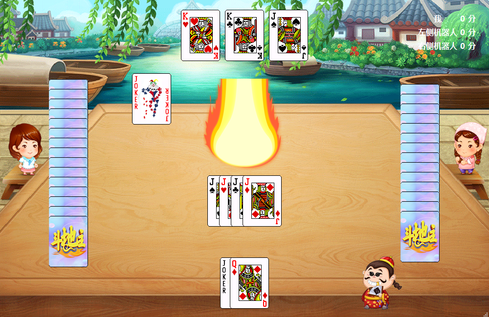

# Landlords (斗地主 - Qt 版)

这是一个使用 C++ 和 Qt 框架开发的单机版“斗地主”棋牌游戏。该项目实现了完整的斗地主游戏逻辑，包括发牌、抢地主、出牌算法、胜负判定以及简单的机器人 AI 策略。

## 🎮 游戏功能

* **完整流程**：支持从游戏开始、发牌、抢地主、叫分到最终结算的全过程。
* **AI 对手**：内置了基本的机器人出牌逻辑（`Strategy` 类），可以实现自动抢地主和出牌。
* **图形化界面**：使用 Qt 的 `QWidget` 和绘图系统，提供流畅的动画效果（如发牌、出牌动画）。
* **出牌规则校验**：严格遵循斗地主规则，支持单张、对子、顺子、连对、三带一、飞机、炸弹等牌型判断。
* **多媒体支持**：包含背景音乐及音效（如背景音乐控制 `BgmControl`）。
* **自定义 UI**：包含各种自定义面板（如分数面板 `ScorePanel`、出牌面板 `CardPanel`）。

## 🛠 开发环境

* **开发语言**：C++ (C++11 或更高版本)
* **开发框架**：Qt 5.15.2 (推荐)
* **构建工具**：qmake
* **编译器**：MinGW / MSVC
* **操作系统**：Windows (已包含部分 Windows 动态库支持)

## 📁 目录结构说明

```text
├── app/                # 编译生成的发布资源及 DLL 依赖
├── build/              # 构建临时文件
├── images/             # 游戏图片资源 (牌面、背景、UI 图标)
├── main.cpp            # 程序入口
├── gamepanel.cpp/h     # 游戏主界面逻辑
├── gamecontrol.cpp/h   # 核心游戏控制器 (状态管理、发牌等)
├── strategy.cpp/h      # AI 出牌策略类
├── playhand.cpp/h      # 出牌算法及牌型校验
├── cards.cpp/h         # 牌组类 (洗牌、排序、管理)
├── player.cpp/h        # 玩家基类 (包含玩家属性、状态)
├── robot.cpp/h         # 机器人玩家实现
├── userplayer.cpp/h    # 用户玩家实现
└── init.pro            # Qt 项目配置文件

```

## 🚀 如何运行

1. **克隆/下载仓库**：
将代码下载到本地。
2. **打开项目**：
使用 **Qt Creator** 打开根目录下的 `init.pro` 文件。
3. **配置编译器**：
在 Qt Creator 中选择合适的 Kit（建议使用 MinGW 32/64 bit）。
4. **构建并运行**：
点击左下角的“运行”按钮（或按下 `Ctrl + R`）。

## 📸 预览



> 游戏主界面：精美的卡牌动画和 AI 对抗过程。

## 📜 核心技术点

* **牌型判断算法**：通过对牌组的数值和频率分析，准确判断合法牌型。
* **信号与槽机制**：利用 Qt 的信号槽实现 UI 与业务逻辑的解耦。
* **资源系统**：通过 `.qrc` 文件管理游戏内所有的图片和音效资源。

---

**说明**：本项目仅供学习交流使用。